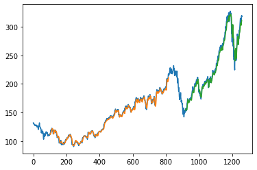

# 📈 Stock Price Prediction Using Stacked LSTM

Predicting stock prices is a challenging task due to their highly non-linear and volatile nature. This repository demonstrates an end-to-end workflow for predicting Apple Inc. (AAPL) stock prices using a Stacked LSTM (Long Short-Term Memory) deep learning model.

---

## 🚀 Project Highlights

- **Author:** [Shivam-26102003](https://github.com/Shivam-26102003)
- **Tech Stack:** Python, Keras, TensorFlow, pandas, matplotlib, scikit-learn, pandas_datareader
- **Objective:** Forecast future stock prices by leveraging the temporal dependencies in historical data with a deep learning approach.
- **Key Features:**
  - End-to-end pipeline: data collection, preprocessing, model training, evaluation, and visualization
  - Uses Stacked LSTM architecture for improved prediction on time series data
  - Visualizes both real and predicted prices
  - Predicts future (next 30 days) stock prices

---

## 📂 Project Structure

- **Stock Price prediction using LSTM.ipynb** — Jupyter Notebook: all code, data processing steps, model building, training, evaluation, and visualizations.

---

## 📊 Sample Results

 <!-- Replace with your actual image path if available -->

- *The above plot demonstrates the model’s ability to fit the historical prices and forecast future trends.*

---

## 🛠️ Installation & Usage

1. **Clone the repository:**
   ```bash
   git clone https://github.com/Shivam-26102003/your-repo-name.git
   cd your-repo-name
   ```

2. **Install dependencies:**
   ```bash
   pip install -r requirements.txt
   ```
   *(If requirements.txt is not present, install manually: keras, tensorflow, pandas, matplotlib, scikit-learn, pandas_datareader)*

3. **Obtain a Tiingo API key:**
   - Register at [Tiingo](https://api.tiingo.com/) and get your API key.
   - Add your key in the notebook where indicated.

4. **Run the Jupyter Notebook:**
   ```bash
   jupyter notebook
   # Open "Stock Price prediction using LSTM.ipynb" and follow the cells.
   ```

---

## 📝 How it Works

- **Data Collection:** Fetches historical AAPL stock data using Tiingo API.
- **Preprocessing:** Cleans, scales, and prepares data for LSTM input.
- **Model Building:** Constructs a stacked LSTM architecture for time-series forecasting.
- **Training & Evaluation:** Trains the model, evaluates RMSE, and visualizes predicted vs. actual prices.
- **Future Forecasting:** Generates and visualizes predictions for the next 30 days.

---

## 🎯 Results & Insights

- The Stacked LSTM captures temporal patterns and trends in AAPL stock prices.
- Achieves strong performance on historical data (see RMSE metrics in notebook).
- The model can be adapted to other stocks or longer forecasting windows.

---

## 🙋 About the Author

**Shivam-26102003**  
Aspiring data scientist & machine learning enthusiast with a passion for tackling real-world problems using AI.  
- [GitHub](https://github.com/Shivam-26102003)
- [LinkedIn](https://www.linkedin.com/in/shivam-sagar-40266225a/) <!-- Replace with your LinkedIn if desired -->

---

## 🧠 Fun Fact

> “Deep learning isn’t just for images and language—it’s a powerful tool for time-series forecasting too!”

---

## 🤝 Contributing

Pull requests are welcome! For major changes, please open an issue first to discuss what you would like to change.

---


## 📜 License

[MIT](LICENSE)

---

*Happy predicting! 📈*
